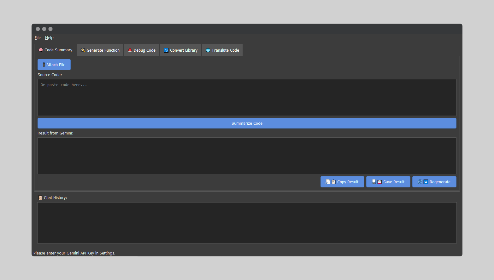

**DevMate AI – Personal Programmer Assistant Documentation**

**Version: 1.0**
**Developer: Mohammed Alhaji**

**Table of Contents:**

1.  [Introduction](#1-introduction)
    *   [Purpose of the Program](#purpose-of-the-program)
    *   [Target Audience](#target-audience)
2.  [System Requirements and Installation](#2-system-requirements-and-installation)
    *   [Prerequisites](#prerequisites)
    *   [Installation Steps](#installation-steps)
    *   [Obtaining a Gemini API Key](#obtaining-a-gemini-api-key)
3.  [Main User Interface](#3-main-user-interface)
    *   [Overview](#overview)
    *   [Menu Bar](#menu-bar)
    *   [Tab Area](#tab-area)
    *   [Chat History](#chat-history)
    *   [Status Bar](#status-bar)
4.  [Settings](#4-program-settings)
    *   [Gemini API Key](#gemini-api-key)
    *   [Interface Language](#interface-language)
    *   [Gemini Model](#gemini-model)
5.  [Core Features (Tabs)](#5-core-features-tabs)
    *   [5.1. Code Summary (🧠)](#51-code-summary-)
    *   [5.2. Generate Function (🛠️)](#52-generate-function-)
    *   [5.3. Debug Code (🚨)](#53-debug-code-)
    *   [5.4. Convert Library (🔄)](#54-convert-library-)
    *   [5.5. Translate Code (🌐)](#55-translate-code-)
    *   [Common Controls for Tab Results](#common-controls-for-tab-results)
        *   [Copy Result](#copy-result)
        *   [Save Result](#save-result)
        *   [Regenerate](#regenerate)
6.  [Advanced Features](#6-advanced-features)
    *   [Context Enrichment via `docs` Folder](#context-enrichment-via-docs-folder)
    *   [Token Usage Tracking and Rate Limits](#token-usage-tracking-and-rate-limits)
7.  [Troubleshooting](#7-troubleshooting)
    *   ["Permission Denied 403" Error](#permission-denied-403-error)
    *   ["API Key Missing" Error](#api-key-missing-error)
    *   [No Results Displayed](#no-results-displayed)
    *   [Markdown Display Issues](#markdown-display-issues)
8.  [Frequently Asked Questions (FAQ)](#8-frequently-asked-questions-faq)
9.  [Contact and Support](#9-contact-and-support)
10. [License](#10-license)

---

## 1. Introduction

### Purpose of the Program

**AI Dev Helper** is a personal programming assistant designed to aid developers in their daily coding-related tasks. Leveraging the power of Google's Large Language Models (Gemini API), the program aims to accelerate and simplify processes such as understanding complex code, generating new functions, debugging, converting code between different libraries, and translating code between programming languages.

The program provides a simple and user-friendly graphical user interface (GUI), supporting both Arabic and English, allowing users to interact efficiently with the Gemini API to accomplish these tasks.

### Target Audience

This program is intended for:

*   **Programmers and Software Developers**: Of all levels, whether beginners seeking a better understanding of code or professionals looking to boost their productivity.
*   **Computer Science and Engineering Students**: As a helpful tool for learning programming concepts and their application.
*   **Anyone dealing with code**: Who needs assistance in understanding, modifying, or transforming it.

## 2. System Requirements and Installation

### Prerequisites

*   **Operating System**: Windows, macOS, or Linux (primarily tested on Windows).
*   **Python**: Version 3.8 or newer.
*   **Internet Connection**: Required to access the Gemini API.
*   **Gemini API Key**: You will need a valid API key from Google.

### Installation Steps


1.  **Navigate to the Project Directory**:
    *   `cd DevMate-AI-main`
2.  **(Recommended) Create and Activate a Virtual Environment**:
    *   `python -m venv venv`
    *   To activate the environment:
        *   **Windows**: `.\venv\Scripts\activate`
        *   **macOS/Linux**: `source venv/bin/activate`
3.  **Install Requirements**:
    *   `pip install -r requirements.txt`
    *   This will install necessary libraries such as `PyQt5`, `google-generativeai`, `markdown2`, and `Pygments`.
4.  **(Optional but important for UI) Add Program Icon**:
    *   Create/download an image file with a `.png` extension (preferably square, e.g., 256x256 pixels).
    *   Save it as `app_icon.png` inside the `ai-dev-helper-project/assets/` folder.
5.  **Run the Program**:
    *   `python app.py`

### Obtaining a Gemini API Key

To use this program, you need a Gemini API key. You can obtain one through:

*   **Google AI Studio**: Follow the instructions on the [Google AI Studio website](https://aistudio.google.com/app/apikey) to create an API key.
*   **Google Cloud Console**: If you prefer to manage your keys via Google Cloud Platform, you can create an API key there and ensure the "Generative Language API" is enabled for your project.

**Important**: Keep your API key secure and do not share it publicly. You will need to enter this key into the program's settings.

## 3. Main User Interface

### Overview

The main user interface consists of several sections:



*   **Menu Bar**: At the top, provides access to File, Settings, and Help.
*   **Tab Area**: The main part of the window, containing tabs for different features.
*   **Chat History**: At the bottom, displays the history of interactions between the user and Gemini.
*   **Status Bar**: At the very bottom of the window, displays status messages and token usage information.

### Menu Bar

*   **File**:
    *   **Settings**: Opens the program settings dialog.
    *   **Exit**: Closes the program.
*   **Help**:
    *   **About**: Displays information about the program, version, and developer.

### Tab Area

This area houses the core functionalities of the program, each in a separate tab:

*   🧠 Code Summary
*   🛠️ Generate Function
*   🚨 Debug Code
*   🔄 Convert Library
*   🌐 Translate Code

Each tab will be detailed later.

### Chat History

*   This section displays all requests you've sent to Gemini and the responses received during the current session.
*   These conversations are also logged to a text file (`logs/chat_history.txt`) for persistence across sessions.
*   The timestamp and the model used are recorded for each interaction.

### Status Bar

*   **Main Message**: Shows the current status of the program (e.g., "Ready", "Processing...", "Error", or warnings related to API key/model).
*   **Token Information (Right Side)**: Displays the number of tokens used in the last successful request (prompt tokens, candidate tokens, and total).
*   **Rate Limit Warnings**: Warning messages may appear here if you are approaching the usage limits (RPM/TPM) for the selected model.

## 4. Program Settings

The settings dialog can be accessed from the "File" -> "Settings" menu.


The settings dialog contains the following options:

### Gemini API Key

*   **Description**: A text field to enter your Gemini API key. This key is essential for the program to function.
*   **Usage**: Paste the API key you obtained from Google here.

### Interface Language

*   **Description**: A dropdown menu to select the display language for the program's user interface.
*   **Available Options**: Arabic (ar), English (en).
*   **Note**: You may need to restart the program for language changes to fully apply to all UI elements.

### Gemini Model

*   **Description**: A dropdown menu to select the Gemini model to be used for API requests.
*   **Available Models (Examples, may vary)**:
    *   `gemini-1.5-pro-latest` (Recommended default)
    *   `gemini-1.5-flash-latest`
    *   `gemini-pro`
    *   (Other models might be added in `core/config.py` if available for your key)
*   **Usage**: Choose the model that best suits your needs and budget (if there are costs associated with advanced models or heavy usage). Models vary in their capabilities, speed, cost, and rate limits.

After making changes, click the "Save Settings" button to apply them.

## 5. Core Features (Tabs)

The program includes several tabs for performing different programming-related tasks:

### 5.1. Code Summary (🧠)

*   **Purpose**: Quickly understand long or complex code snippets by obtaining a summary of their main functionality and important parts.
*   **Usage**:
    1.  Paste the code you want to summarize into the "Source Code" input field.
    2.  Alternatively, click the "📎 Attach File" button to select a code file (e.g., `.py`, `.txt`) from your computer.
    3.  Click the "Summarize Code" button.
*   **Result**: Gemini will analyze the code and provide a textual summary (in Markdown format) in the "Result from Gemini" area.

### 5.2. Generate Function (🛠️)

*   **Purpose**: Create Python function code based on a textual description of the desired task.
*   **Usage**:
    1.  In the "Describe the desired function" field, write a clear and detailed description of the function you want to create.
    2.  (Optional) In the "Optional libraries" field, list any Python libraries (e.g., `numpy`, `pandas`), separated by commas, that you would like the model to use when generating the function.
    3.  Click the "Generate Function" button.
*   **Result**: Gemini will generate Python function code (enclosed in ```python ... ``` Markdown) based on your description.

### 5.3. Debug Code (🚨)

*   **Purpose**: Help identify potential errors, logical issues, or improvement suggestions in existing code.
*   **Usage**:
    1.  Paste the code you want to analyze into the "Source Code" input field.
    2.  Alternatively, click the "📎 Attach File" button to select a code file.
    3.  Click the "Analyze Code" button.
*   **Result**: Gemini will provide a report (in Markdown format) explaining potential problems in the code, with suggestions for correction or improvement.

### 5.4. Convert Library (🔄)

*   **Purpose**: Transform Python code written using one library to work with an alternative library (e.g., converting UI code from Tkinter to PyQt5).
*   **Usage**:
    1.  Paste the original code into the "Source Code" field or attach a file.
    2.  In the "Source Library" field, enter the name of the library used in the original code (e.g., `tkinter`).
    3.  In the "Target Library" field, enter the name of the library you want to convert to (e.g., `PyQt5`).
    4.  Click the "Convert Library" button.
*   **Result**: Gemini will attempt to provide a version of the code modified to use the target library, preserving functionality as much as possible.

### 5.5. Translate Code (🌐)

*   **Purpose**: Translate code snippets from one programming language to another.
*   **Usage**:
    1.  Paste the code you want to translate into the "Source Code" field or attach a file.
    2.  From the "Source Language" dropdown, select the original programming language of the code. (The program attempts to guess this when attaching a file based on its extension).
    3.  From the "Target Language" dropdown, select the programming language you want to translate the code into.
    4.  Click the "Translate Code" button.
*   **Result**: Gemini will provide the code translated into the target language, enclosed in a Markdown code block appropriate for the target language.

### Common Controls for Tab Results

Below the "Result from Gemini" area in each tab, you will find the following buttons:

#### Copy Result (📋)

*   Copies the content of the result area (as plain text) to the system clipboard, allowing you to paste it into your code editor or elsewhere.

#### Save Result (💾)

*   Opens a dialog to save the content of the result area to a file.
*   You can choose the filename, location, and type (defaults to `.md` or `.py` if the content looks like Python code).

#### Regenerate (🔁)

*   Resends the *exact same last request* that produced the currently displayed result to Gemini.
*   This is useful for getting an alternative or differently phrased answer without re-entering data.
*   It uses a slightly higher temperature setting in the `GeminiWorker` to encourage varied output.
*   If there was no previous request in the current tab, a message will indicate this.

## 6. Advanced Features

### Context Enrichment via `docs` Folder

*   You can create a folder named `docs` in the same directory where the main program executable (`app.py`) is located.
*   Place text files (`.txt`) or Markdown files (`.md`) inside this folder containing additional information about your project, such as:
    *   Portions of project documentation.
    *   Specific requirements.
    *   Preferred coding style.
    *   Relevant code snippets.
*   When you send any request to Gemini, the program will read the content of these files and append it to the prompt as additional context. This helps Gemini understand your project better and provide more accurate and tailored responses.
*   Upon program startup, you will be notified if files were loaded from this folder or if the folder was not found/empty.

### Token Usage Tracking and Rate Limits

*   **Usage Display**: After each successful request, the program will attempt to display the number of tokens consumed (prompt, candidate, and total) in the status bar.
*   **Rate Limit Tracking (RPM/TPM)**:
    *   The program performs approximate tracking of Requests Per Minute (RPM) and Tokens Per Minute (TPM) consumed *during the current application session*.
    *   RPM and TPM limits for each model are defined in `core/config.py` (in the `MODEL_LIMITS` dictionary). **Important**: Ensure these values match the official Google limits for your specific models and API key.
    *   If usage approaches these limits (default 80%, defined by `RATE_LIMIT_WARNING_THRESHOLD` in `core/config.py`), a warning message will appear in the status bar.
    *   If the calculated RPM limit is reached, a new request might be temporarily blocked, and a dialog box will appear.
*   **Tracking Limitations**:
    *   Tracking is only for the current session and does not account for usage via other applications or previous sessions.
    *   Daily limits (RPD) are not directly tracked within the application.
    *   **For accurate information on your usage and remaining quota, always refer to your Google Cloud Console or Google AI Studio dashboard.**

## 7. Troubleshooting

### "Permission Denied 403" Error

*   **Cause**: This usually indicates an issue with the permissions related to your Gemini API key.
*   **Potential Solutions**:
    1.  **Verify API Key**: Ensure the key entered in settings is correct and not expired. Try generating a new key.
    2.  **Enable API for Project**: If using a Google Cloud key, make sure the "Generative Language API" (or Gemini equivalent) is enabled for your project.
    3.  **API Key Restrictions**: Check any restrictions applied to your API key in the Google Cloud Console (IP restrictions, allowed APIs).
    4.  **Billing Issues**: Ensure your Google Cloud project has an active and valid billing account.

### "API Key Missing" Error

*   **Cause**: The Gemini API key has not been entered in the program settings.
*   **Solution**: Go to "File" -> "Settings" and enter a valid API key in the designated field.

### No Results Displayed

*   **Potential Causes**:
    *   Internet connectivity issues.
    *   Incorrect API key or permission problems (see 403 error).
    *   API rate limits exceeded (RPM, TPM, or daily limits). Check the status bar for warnings and consult your Google Cloud Console.
    *   The prompt you sent might have been blocked by Gemini's safety filters.
    *   Temporary issues with Gemini servers.
*   **Solution**: Check your internet connection, API key validity, and usage limits. Try simplifying your prompt. If the issue persists, wait a while and try again.

### Markdown Display Issues

*   **Cause**: The program uses the `markdown2` library to convert Gemini's Markdown responses to HTML for display.
*   **Solution**:
    *   Ensure `markdown2` and `Pygments` (for code highlighting) are correctly installed (via `requirements.txt`).
    *   If the display is still not perfect, it might be due to the complexity of the returned Markdown or limitations in the simple HTML conversion used.

## 8. Frequently Asked Questions (FAQ)

*   **Q: Can I use the program offline?**
    *   A: No, the program requires an internet connection to access the Gemini API.
*   **Q: Is the program free to use?**
    *   A: The program itself is free (and open source, if you choose). However, using the Gemini API may incur costs based on the model used and usage volume, according to Google's pricing. Basic models often have a generous free tier.
*   **Q: How can I contribute to the program's development?**
    *   A: You can contribute by reporting bugs, suggesting new features, or submitting pull requests with code to the project repository .
*   **Q: Is my data (code, prompts) secure?**
    *   A: The program sends the code and prompts you enter to Google's servers for processing by the Gemini API. You should review Google's privacy policy and Gemini API terms of service to understand how your data is handled. The program itself does not store your data permanently on external servers other than those used by Google for the API. Chat history is stored locally on your device.

## 9. Contact and Support

*   **Developer**: Mohammed Alhaji
*   **For bug reports or suggestions**: please open an issue at [GitHub Issues](https://github.com/hamadasyr/DevMate-AI/issues).

## 10. License

This project is licensed under the MIT License.  
See the [LICENSE](./LICENSE) file for details.

## Contributors
- [@hamadasyr](https://github.com/hamadasyr)
- [@imsara-py](https://github.com/imsara-py) 
